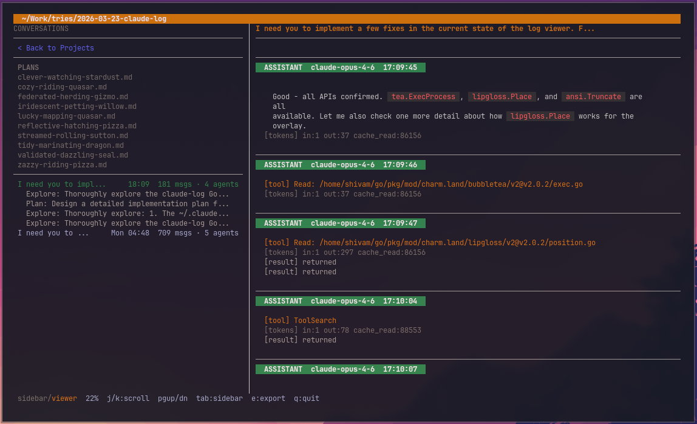

# ccview

A terminal-based explorer and renderer for [Claude Code](https://docs.anthropic.com/en/docs/claude-code) conversation histories. Browse projects, view conversations with markdown rendering, inspect sub-agents, and export to HTML/Markdown/JSONL.

Built with [Bubble Tea](https://github.com/charmbracelet/bubbletea), [Lip Gloss](https://github.com/charmbracelet/lipgloss), and [Glamour](https://github.com/charmbracelet/glamour).



## Install

### Download binary (easiest)

Download the latest release for your platform from [GitHub Releases](https://github.com/shivamstaq/ccview/releases/latest).

**Linux**

```bash
curl -Lo ccview.tar.gz https://github.com/shivamstaq/ccview/releases/latest/download/ccview_$(curl -s https://api.github.com/repos/shivamstaq/ccview/releases/latest | grep tag_name | cut -d '"' -f 4 | sed 's/v//')_linux_amd64.tar.gz
tar xzf ccview.tar.gz
sudo mv ccview /usr/local/bin/
```

**macOS**

```bash
# Apple Silicon (M1/M2/M3/M4)
curl -Lo ccview.tar.gz https://github.com/shivamstaq/ccview/releases/latest/download/ccview_$(curl -s https://api.github.com/repos/shivamstaq/ccview/releases/latest | grep tag_name | cut -d '"' -f 4 | sed 's/v//')_darwin_arm64.tar.gz
tar xzf ccview.tar.gz
sudo mv ccview /usr/local/bin/

# Intel
curl -Lo ccview.tar.gz https://github.com/shivamstaq/ccview/releases/latest/download/ccview_$(curl -s https://api.github.com/repos/shivamstaq/ccview/releases/latest | grep tag_name | cut -d '"' -f 4 | sed 's/v//')_darwin_amd64.tar.gz
tar xzf ccview.tar.gz
sudo mv ccview /usr/local/bin/
```

**Windows (PowerShell)**

```powershell
$version = (Invoke-RestMethod "https://api.github.com/repos/shivamstaq/ccview/releases/latest").tag_name -replace '^v',''
Invoke-WebRequest -Uri "https://github.com/shivamstaq/ccview/releases/latest/download/ccview_${version}_windows_amd64.zip" -OutFile ccview.zip
Expand-Archive ccview.zip -DestinationPath "$env:LOCALAPPDATA\ccview" -Force
# Add $env:LOCALAPPDATA\ccview to your PATH
```

### Via `go install`

Requires [Go 1.23+](https://go.dev/dl/). Works on all platforms.

```bash
go install github.com/shivamstaq/ccview@latest
```

### From source

```bash
git clone https://github.com/shivamstaq/ccview.git
cd ccview
go build -o ccview .
```

## Quick Start

```bash
# Launch the interactive TUI explorer
ccview

# Start the web UI
ccview --web

# View a specific conversation file
ccview --file path/to/conversation.jsonl

# Export a conversation to HTML
ccview --export output.html --file path/to/conversation.jsonl
```

## Features

### TUI Explorer (default)

```bash
ccview
```

Split-pane interactive explorer. Left pane shows the project tree with conversations, plans, and memory files. Right pane renders conversation content with syntax-highlighted markdown.

- Conversations sorted newest-first with smart timestamps
- Sub-agents collapsed by default, expand on selection
- Global plans shown in sidebar
- Tool calls wrap cleanly with aligned continuation lines
- Press `o` to open any file in your `$EDITOR`
- Press `e` for a guided export wizard (format, path, filename)

### Web Explorer

```bash
ccview --web
ccview --web --port 8080
```

Opens an interactive web UI at `http://localhost:3333` with collapsible thinking blocks, tool call cards, and token usage display.

### Export

Press `e` in the TUI to open the export wizard, or use the CLI:

```bash
ccview --export output.html --file conversation.jsonl
```

**Supported formats:**
- **HTML** - Dark-themed, self-contained, syntax-highlighted
- **Markdown** - Clean readable markdown with headers and blockquoted tool calls
- **JSONL** - Raw copy of the original conversation file

For full conversations with sub-agents, HTML export creates a directory with `index.html` linking to individual sub-agent pages.

## Keybindings

### Sidebar

| Key | Action |
|-----|--------|
| `j` / `k` | Navigate up/down |
| `Enter` | Open conversation / expand sub-agents |
| `l` / `Right` | Switch to viewer |
| `h` / `Left` / `Esc` | Back to project list |
| `Tab` | Switch to viewer pane |
| `e` | Export wizard |
| `o` | Open in `$EDITOR` |
| `g` / `G` | Jump to top/bottom |
| `q` | Quit |

### Viewer

| Key | Action |
|-----|--------|
| `j` / `k` | Scroll up/down |
| `Space` / `f` | Page down |
| `b` | Page up |
| `g` / `G` | Jump to top/bottom |
| `Tab` / `h` | Switch to sidebar |
| `e` | Export wizard |
| `o` | Open in `$EDITOR` |
| `q` | Quit |

## What it reads

ccview reads from `~/.claude/` and organizes data as:

| Source | Description |
|--------|-------------|
| `~/.claude/projects/*/` | Project directories grouped by working directory |
| `*.jsonl` | Conversation message logs |
| `*/subagents/*.jsonl` | Sub-agent conversation threads |
| `*/subagents/*.meta.json` | Agent type metadata |
| `*/memory/*.md` | Per-project memory files |
| `*/CLAUDE.md` | Project-level instructions |
| `~/.claude/plans/*.md` | Plan documents |

### Message types rendered

- **User messages** - with markdown rendering
- **Assistant messages** - with model name, markdown, token usage
- **Thinking blocks** - truncated in TUI, collapsible in web/HTML
- **Tool calls** - summarized with wrapped overflow (Read, Write, Edit, Bash, Grep, Glob, Agent, etc.)
- **System messages** - slash commands shown inline

## Architecture

```
main.go       CLI entry point, flag parsing
data.go       Tree types, project scanning, filesystem loading
parse.go      JSONL parsing, glamour rendering, formatting helpers
ui.go         Bubble Tea TUI with split-pane layout
server.go     HTTP server with embedded SPA
export.go     HTML/Markdown/JSONL export
```

## Dependencies

- [charm.land/bubbletea/v2](https://github.com/charmbracelet/bubbletea) - TUI framework
- [charm.land/lipgloss/v2](https://github.com/charmbracelet/lipgloss) - Terminal styling
- [github.com/charmbracelet/glamour](https://github.com/charmbracelet/glamour) - Terminal markdown rendering
- [github.com/charmbracelet/x/ansi](https://github.com/charmbracelet/x) - ANSI-aware string handling
- [github.com/yuin/goldmark](https://github.com/yuin/goldmark) - HTML markdown rendering

## License

[MIT](LICENSE)
